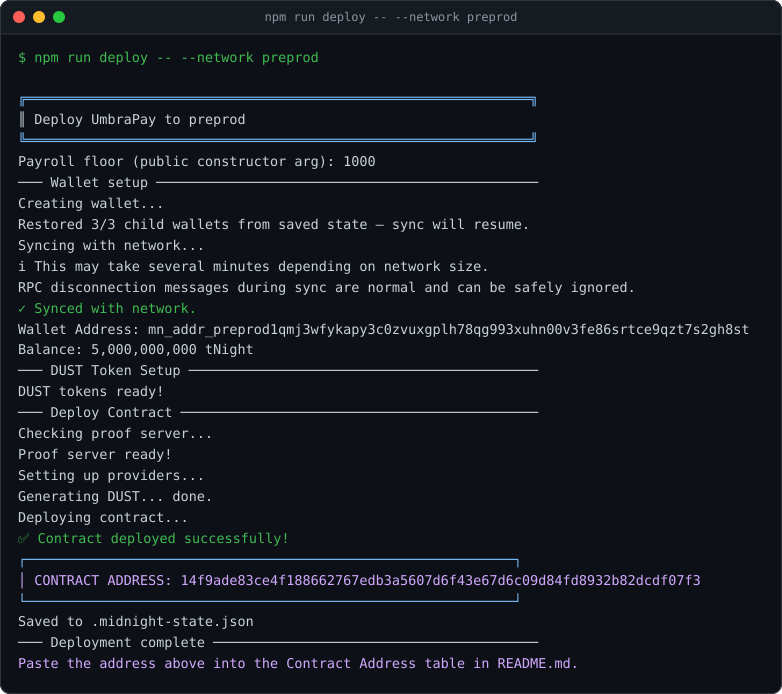
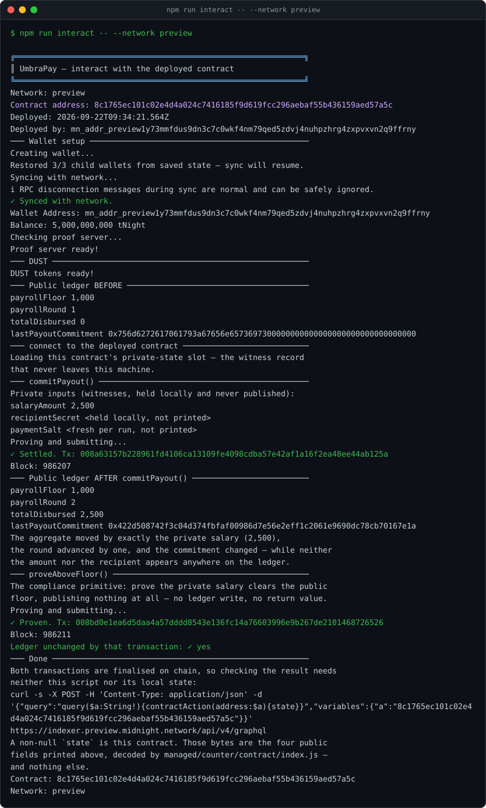

# UmbraPay

> Payroll that proves it is fair without revealing who earns what.

UmbraPay is a private payroll settlement contract on the [Midnight](https://midnight.network/)
network. Organisations publish that a payroll ran, that it respected a minimum-wage
floor, and what it paid in total — while every individual salary and every recipient
identity stays on the payer's own device.

[](https://github.com/olaleyeolajide81-sketch/UmbraPay/actions/workflows/ci.yml)

---

## Project Status

| Piece | State |
|---|---|
| Level 1 settlement core (`contracts/counter.compact`) | ✅ Complete — 3 circuits, compiled artifacts committed for review |
| Test suite | ✅ 16/16 passing (`npm test`) — circuit logic, state transitions, privacy guarantees |
| Deploy tooling (Preview / Preprod) | ✅ Complete — used for the live Preview and Preprod deployments |
| Contract address | ✅ Deployed on Preview (`8c17…a5c`) and Preprod (`14f9…7f3`), see [Contract Address](#contract-address) |
| Deployer wallets | ✅ Derived for Preview and Preprod — see [Deployer Wallets](#deployer-wallets) |
| On-chain interaction | ✅ Exercised against the live Preview deployment — `npm run interact`, see [Interacting with the deployed contract](#interacting-with-the-deployed-contract) |
| Level 2 (frontend, decoy payouts, batched disclosure) | 🔭 Scoped, not built |
| Level 3 (CI enforcing the toolchain version lock) | ✅ Complete — `.github/workflows/ci.yml`, see [Continuous Integration](#continuous-integration) |

---

## Contract Address

| Network  | Address                                              |
|----------|------------------------------------------------------|
| Preview  | `8c1765ec101c02e4d4a024c7416185f9d619fcc296aebaf55b436159aed57a5c` |
| Preprod  | `14f9ade83ce4f188662767edb3a5607d6f43e67d6c09d84fd8932b82dcdf07f3` |

> **Deploy status.** Deployed to **Preview** on 2026-09-22 and to **Preprod** on
> 2026-09-23, both with the same procedure: derive the wallet with
> `npm run address -- --network <net>`, fund it from that network's faucet, let DUST
> accrue from the registered NIGHT UTXOs, then `npm run deploy -- --network <net>`. The
> contract is proved and submitted through the pinned 0.31.1 toolchain in both cases. The
> deployer wallets are listed under [Deployer Wallets](#deployer-wallets), and each wallet
> plus its contract address is recorded in the gitignored `.midnight-state.json`.
>
> The Preprod deploy was first blocked by a Preprod **indexer** outage — its load balancer
> (`server: awselb/2.0`) returned `503` with no healthy backends for roughly an hour, while
> the node itself kept producing blocks with a healthy peer count. A wallet discovers its
> UTXOs and DUST through the indexer, so the DUST gate could not pass until it recovered;
> the deploy then succeeded on the first attempt. Both addresses in the table above are
> confirmed on chain, not merely printed by the script.

---

## Deployer Wallets

The wallet each network's deploy tooling derived, as printed by `npm run address`. Both are
derived deterministically from the seeds in the gitignored `.midnight-state.json`, so
reproducing them takes no sync and no RPC call.

| Network | Unshielded wallet address | Contract |
|---|---|---|
| Preview | `mn_addr_preview1y73mmfdus9dn3c7c0wkf4nm79qed5zdvj4nuhpzhrg4zxpvxvn2q9ffrny` | Deployed `8c17…a5c` on 2026-09-22 |
| Preprod | `mn_addr_preprod1qmj3wfykapy3c0zvuxgplh78qg993xuhn00v3fe86srtce9qzt7s2gh8st` | Deployed `14f9…7f3` on 2026-09-23 |

Faucets: [Preview](https://midnight-tmnight-preview.nethermind.dev) ·
[Preprod](https://midnight-tmnight-preprod.nethermind.dev)

An unshielded address is a *receiving* address, not key material — publishing it is safe,
and it is what a faucet is given. The seeds and recovery phrases that **control** these
wallets are not in this repository: they live only in the gitignored
`.midnight-state.json`.

---

## What This Does

A normal on-chain payroll leaks everything: every salary and every recipient is public
forever. A normal off-chain payroll proves nothing, so employees and auditors have to
take the numbers on trust. UmbraPay sits in between.

For each payout, the payer's device proves three things to the chain:

1. **The salary clears a published minimum.** `payrollFloor` is public ledger state, so
   anyone can verify that nobody was paid below it.
2. **This payout is the one being claimed.** The contract publishes a commitment — a
   hash binding the amount, the recipient, and a per-payment salt — which acts as a
   tamper-evident receipt without revealing any of those three inputs.
3. **The published total is the real total.** `totalDisbursed` accumulates on-chain, so
   the aggregate is auditable and the individual amounts are not.

The result: a payroll that can be audited in aggregate and audited for policy compliance,
while remaining unreadable one row at a time.

---

## Privacy Model

### What is PUBLIC (on-chain, visible to anyone)

| Ledger field | Type | What it reveals |
|---|---|---|
| `payrollRound` | `Counter` | How many payout rounds have settled. Reveals that a payout happened, nothing more. |
| `totalDisbursed` | `Uint<64>` | The running *aggregate* of all payouts. |
| `payrollFloor` | `Uint<64>` | The minimum any worker may be paid. A published policy constant, deliberately disclosed in the constructor. |
| `lastPayoutCommitment` | `Bytes<32>` | A hash binding the latest payout's `(amount, recipientSecret, paymentSalt)`. A receipt whose preimage is never published. |

### What is PRIVATE (private witness, never on-chain)

| Witness | Type | Why it is private |
|---|---|---|
| `salaryAmount()` | `Uint<64>` | What this individual is actually paid. |
| `recipientSecret()` | `Bytes<32>` | Who the payment is for. |
| `paymentSalt()` | `Bytes<32>` | Per-payment randomness, so two equal salaries never produce equal commitments. |

These are supplied by the prover and never written to the ledger. The tests prove this
mechanically rather than asserting it — see [Privacy Tests](#privacy-tests).

### What the user PROVES without revealing

- **`commitPayout()`** — *"I know an `(amount, secret, salt)` triple that hashes to the
  commitment I am publishing, and that amount is at least `payrollFloor`."* The verifier
  learns the floor was respected and that the aggregate moved. They never learn the
  amount or the recipient.
- **`proveAboveFloor()`** — *"the salary I hold privately clears the public floor."*
  Publishes **nothing at all**: no ledger write, no return value. A pure zero-knowledge
  assertion, and the compliance primitive an auditor actually wants.

### On `disclose()`

In Compact, a witness-derived value cannot reach the ledger unless the developer explicitly
wraps it in `disclose()`. That friction is the point, and this contract uses it at exactly
**three auditable call sites**, each on data already designed to be public:

```compact
payrollFloor = disclose(floor);                              // constructor arg — private
                                                             // input, public policy constant
const publicCommitment = disclose(payoutCommitment(...));    // the receipt hash, not its preimage
totalDisbursed = disclose((totalDisbursed + amount) as Uint<64>);  // the aggregate
```

**No `disclose()` is ever applied directly to `salaryAmount()`, `recipientSecret()`, or
`paymentSalt()`.** The disclosure surface is three lines you can read, not a scattered one.

> The compiler enforced this rather than us remembering it. The constructor's `floor`
> parameter is a *private circuit input* like any witness, and `compact compile` refused
> to let `payrollFloor = floor` leak silently — it demanded an explicit `disclose`.
> That is the single best argument for using this language.

### Known limitation (Level 1)

`totalDisbursed` is a deliberate disclosure, so **a payroll with exactly one participant
leaks that participant's salary through the aggregate** — the recipient stays private, the
amount does not. A real payroll has several participants, in which case only the aggregate
is published and the split stays private. There is an explicit test pinning this behaviour
(`documents a known Level 1 limit: a one-participant payroll exposes that salary via the
aggregate`) so it cannot regress silently. Level 2 addresses it with decoy payouts and
batched disclosure windows.

---

## Tech Stack

- **Midnight network** — Preview / Preprod testnets, or a local devnet
- **Compact language** — the privacy-preserving smart contract language
- **Compact toolchain 0.31.1** — pinned; see [the version lock](#the-toolchainruntime-version-lock)
- **Node.js 22** (v22.15+ required)
- **Docker** — runs the proof server
- **TypeScript + Vitest** — contract tests over `compact-runtime`
- **midnight-js 4.1.1 + wallet-sdk 1.2.0** — deployment and wallet plumbing

---

## Prerequisites

| Requirement | Version | Check |
|---|---|---|
| Node.js | v22.15+ | `node --version` |
| npm | v10+ | `npm --version` |
| Docker (with Compose v2) | any recent | `docker info` |
| Compact devtools | 0.5.x | `compact --version` |
| Compact toolchain | 0.31.1 | `compact compile --version` |

The **Compact compiler is not an npm package.** `npm install -g
@midnight-ntwrk/compact-compiler` does not exist (404). Install the devtools, then let
`compact` manage the toolchain:

```bash
# 1. Install the Compact devtools
curl --proto '=https' --tlsv1.2 -LsSf \
  https://github.com/midnightntwrk/compact/releases/latest/download/compact-installer.sh | sh

# 2. Put it on PATH
source $HOME/.local/bin/env

# 3. Install the toolchain version this project pins
compact update "$(cat .compact-version)"     # → 0.31.1

# 4. Verify
compact compile --version                     # → 0.31.1
```

---

## Setup

```bash
# Clone
git clone https://github.com/olaleyeolajide81-sketch/UmbraPay
cd UmbraPay

# Install dependencies
npm install

# Start the proof server (required to deploy and to interact on-chain)
docker compose up -d

# Compile the contract
npm run compact
```

`npm run compact` runs:

```bash
compact compile contracts/counter.compact managed/counter
```

You should see:

```
Compiling 3 circuits:
```

and a `managed/counter/` directory containing:

```
managed/counter/
├── compiler/           contract-info.json
├── contract/           index.js, index.d.ts   ← the TypeScript binding
├── keys/               <circuit>.prover, <circuit>.verifier   ← per circuit
└── zkir/               <circuit>.zkir, <circuit>.bzkir        ← ZK intermediate representation
```

### Optional: live Midnight documentation via MCP

`.mcp.json` wires the Midnight docs MCP server for Claude Code / Cursor users. Note that
`https://midnight.mcp.kapa.ai` is **OAuth-protected** — it returns `401` until you
authenticate through your client's MCP UI.

---

## Run Tests

```bash
npm test
```

Expected:

```
✓ tests/counter.test.ts (16 tests)

Test Files  1 passed (1)
     Tests  16 passed (16)
```

Also available:

```bash
npm run typecheck     # tsc --noEmit
npm run test:compile  # recompile the contract, then test
```

The suite needs **no Docker, no wallet, and no network** — it runs the compiled contract
in-process against `compact-runtime`.

### What the tests cover

**Circuit logic** (6 tests) — the aggregate moves by exactly the private amount; a payout
below the floor is rejected; the floor boundary is inclusive; `proveAboveFloor` publishes
nothing; `remainingBudget` reads correctly and rejects an exceeded budget.

**State transitions** (4 tests) — initialisation publishes the disclosed floor with a zero
aggregate; initialisation is deterministic across independent deployments; the aggregate
accumulates and the round counter advances once per payout; identical private inputs yield
identical commitments.

**Privacy guarantees** (6 tests) — the interesting ones.

### Privacy Tests

These do not assert intent. They read the actual `Ledger` object the contract produced and
search its bytes for the private values:

- `never writes any private input to the public ledger` — searches the flattened ledger
  bytes for the raw `recipientSecret` and `paymentSalt`.
- `does not publish an individual salary anywhere in the ledger bytes` — settles two
  payouts (4000 and 6000), confirms the published aggregate is 10000, and confirms
  **neither** 4000 nor 6000 appears anywhere, in the same 32-byte big-endian encoding the
  contract uses internally for amounts.
- `exposes only the four declared public fields on the ledger` — asserts the ledger has
  exactly the four public keys and no witness-named key.
- `keeps two equal salaries unlinkable via per-payment salt` — two identical salaries with
  different salts produce different commitments, so equal earners cannot be clustered off
  the ledger.
- `keeps the private state off the ledger and restorable from the local record` — the
  private record survives settling, and none of it reaches the chain.
- `documents a known Level 1 limit...` — pins the one-participant aggregate leak.

---

## Continuous Integration

`.github/workflows/ci.yml` runs on every push to `main` and on every pull request. It is
Level 3 of the project plan: the version lock documented below, enforced by the pipeline
instead of rediscovered by each contributor at deploy time.

| Job | What it does |
|---|---|
| `typecheck + tests` | `npm run typecheck`, then the 16-test suite against the committed `managed/` bindings. Node only — no proof server, no wallet, no funds. Also asserts that exactly **one** copy of the onchain runtime is installed — see [the second trap](#the-second-trap-two-copies-of-the-onchain-runtime). |
| `contract + toolchain lock` | Installs the Compact devtools, installs the toolchain pinned in `.compact-version`, recompiles `contracts/counter.compact` from source, and asserts the three things below. |

The `contract` job fails the build when any of these is true:

1. **The active toolchain is not the pinned one.** `compact compile --version` must equal
   `.compact-version` — 0.31.1.
2. **`managed/` drifts from a fresh compile.** The job recompiles into a scratch directory
   and diffs it against the committed artifacts. Circuits, ZKIR and the prover/verifier keys
   reproduce byte-for-byte; only `contract/index.js.map` is excluded, because its
   `sourceRoot` is written relative to the output directory.
3. **The generated runtime version disagrees with the JS runtime.** The
   `checkRuntimeVersion` call the compiler baked into `managed/counter/contract/index.js`
   must match the `@midnight-ntwrk/compact-runtime` pin in `package.json` — 0.16.0. This is
   the check that catches the trap: a newer toolchain with an older midnight-js compiles
   happily and then refuses to load at deploy time.

Both jobs run on a plain GitHub runner, because the tests need nothing but Node. Deploys
and on-chain calls stay deliberate human actions — see below.

---

## Deploying

### 1. Check your wallet address and fund it

```bash
npm run address -- --network preview
```

This derives the address from the seed instantly (no sync) and prints the faucet URL.
Fund it at the **Preview faucet**: <https://midnight-tmnight-preview.nethermind.dev>

### 2. Deploy

```bash
npm run deploy -- --network preview
```

The script:

1. Resolves the network and gets or generates this network's wallet (a new wallet prints
   its 24-word recovery phrase **once** — back it up).
2. Syncs the wallet. **On Preview the first sync takes ~15 minutes**, as it replays from
   genesis. Sync state is cached in `.midnight-wallet-state/`, so later runs are fast.
3. Polls for your faucet funds if the balance is zero.
4. Registers NIGHT for DUST generation and waits for DUST (the fee resource).
5. Proves and submits the deployment, then prints the contract address.

The constructor takes the public payroll floor. Override it with:

```bash
MIDNIGHT_PAYROLL_FLOOR=2500 npm run deploy -- --network preview
```

For Preprod:

```bash
npm run address -- --network preprod     # faucet: https://midnight-tmnight-preprod.nethermind.dev
npm run deploy  -- --network preprod
```

### Proof server

```bash
docker compose up -d      # start (pinned to proof-server 8.1.0)
docker compose down       # stop
```

If the proof server is not running, proofs fail with `connect ECONNREFUSED 127.0.0.1:6300`.

---

## Interacting with the deployed contract

Deploying proves the contract *can* be deployed. This proves it *runs*:

```bash
npm run interact -- --network preview
MIDNIGHT_SALARY_AMOUNT=2500 npm run interact -- --network preview   # default: the on-chain floor
```

It settles a real payout and then runs the compliance circuit, printing the public ledger
before and after each one. This is the live Preview deployment, not a simulation:

```
─── commitPayout() ─────────────────────────────────────────────
  Private inputs (witnesses, held locally and never published):
    salaryAmount     2,500
    recipientSecret  <held locally, not printed>
    paymentSalt      <fresh per run, not printed>
  ✓ Settled. Tx: 008a63157b228961fd4106ca13109fe4098cdba57e42af1a16f2ea48ee44ab125a
             Block: 986207
─── Public ledger AFTER commitPayout() ─────────────────────────
  payrollFloor          1,000
  payrollRound          2
  totalDisbursed        2,500
  lastPayoutCommitment  0x422d508742f3c04d374fbfaf00986d7e56e2eff1c2061e9690dc78cb70167e1a

─── proveAboveFloor() ──────────────────────────────────────────
  ✓ Proven. Tx: 008bd0e1ea6d5daa4a57dddd8543e136fc14a76603996e9b267de2101468726526
            Block: 986211
  Ledger unchanged by that transaction: ✓ yes
```

The aggregate moved by exactly the private salary, the round advanced by one, and the
commitment changed — while neither the amount nor the recipient is anywhere on the ledger.
`proveAboveFloor()` then submits a second transaction that publishes **nothing at all**:
no ledger write, no return value. The script re-reads the ledger and asserts it is unchanged,
and exits non-zero if a circuit that must publish nothing ever moves state.

Each run holds its own private record, with a fresh salt, which is what a real payment does:
two runs paying the same salary publish different commitments, so equal pay cannot be
clustered off the ledger. The recipient secret and the salt are never printed — pin them
with `MIDNIGHT_RECIPIENT_SECRET` / `MIDNIGHT_PAYMENT_SALT` only when you need reproducible
output.

Both transactions are verifiable without trusting this repository or its local state:

```bash
curl -s -X POST -H 'Content-Type: application/json' \
  -d '{"query":"query($o: TransactionOffset!){ transactions(offset:$o){ id hash block{ height timestamp } ... on RegularTransaction { transactionResult { status } } } }","variables":{"o":{"identifier":"008a63157b228961fd4106ca13109fe4098cdba57e42af1a16f2ea48ee44ab125a"}}}' \
  https://indexer.preview.midnight.network/api/v4/graphql
# → "transactionResult": { "status": "SUCCESS" }, block 986207
```

---

## The toolchain/runtime version lock

**This is the trap that costs the most time on Midnight, so it is worth stating plainly.**

The Compact compiler and the JavaScript runtime are **version-locked**. A contract compiled
by toolchain X refuses to load under a mismatched runtime — the generated code opens with
`__compactRuntime.checkRuntimeVersion('...')` and throws if it disagrees.

Installing the newest toolchain is the wrong move:

| Combination | Result |
|---|---|
| Toolchain `0.34.0` (latest) | Emits `checkRuntimeVersion('0.19.0')`. midnight-js 4.1.1 pins compact-runtime to **exactly `0.16.0`**, so the contract compiles but **fails to load at deploy time**. |
| Toolchain **`0.31.1`** ✅ | Emits `checkRuntimeVersion('0.16.0')` — matches. |

`@midnight-ntwrk/compact-js@2.5.1` declares `"@midnight-ntwrk/compact-runtime": "0.16.0"`
as an exact pin, and the Midnight `create-mn-app` scaffolder pins `0.31.1` in its
`.compact-version`. This project pins the same value in `.compact-version` — **always
install the pinned toolchain, not the latest.**

```bash
compact update "$(cat .compact-version)"   # installs 0.31.1 and makes it the default
compact compile --version                  # → 0.31.1
```

`compact update <version>` sets the default compiler as it installs, so there is no separate
step to switch to it (`compact use` is not a subcommand of the 0.5.x devtools).

**CI enforces all of this** — the `contract` job fails the build if the active toolchain is
not the pinned one, if `managed/` drifts from a fresh compile, or if the runtime version the
compiler emitted disagrees with the `compact-runtime` pin in `package.json`. See
[Continuous Integration](#continuous-integration).

If you see a runtime version mismatch error, this is the cause.

### The second trap: two copies of the onchain runtime

The compiler/runtime lock above is about *versions*. This one is about *copies*, and it only
bites once the contract is already deployed.

`compact-runtime@0.16.0` declares `@midnight-ntwrk/onchain-runtime-v3: ^3.0.0`, while
`midnight-js-protocol@4.1.1` pins the same package to **exactly `3.0.0`**. A plain
`npm install` satisfies both declarations literally — hoisting `3.1.1` for the runtime and
nesting `3.0.0` under the protocol:

```
umbrapay@0.1.0
├─┬ @midnight-ntwrk/compact-runtime@0.16.0
│ └── @midnight-ntwrk/onchain-runtime-v3@3.1.1      ← hoisted, satisfies ^3.0.0
└─┬ @midnight-ntwrk/midnight-js-protocol@4.1.1
  └── @midnight-ntwrk/onchain-runtime-v3@3.0.0      ← nested, satisfies the exact pin
```

Two copies means two `StateValue` *classes*, and `instanceof` compares classes, not versions.
Deploying still works, which is what makes this one nasty — `deployContract` runs the
constructor locally, so the state it produces is internally consistent. It breaks on the
first **circuit call against an already-deployed contract**: the SDK fetches the contract
state through the indexer (one copy) and builds a `ChargedState` from the other.

```
Error: Unexpected error executing scoped transaction '<unnamed>':
  Error: expected instance of StateValue
```

Pin the deduped version: `3.0.0` satisfies both declarations, because it sits inside
`compact-runtime`'s `^3.0.0` range and is exactly what `midnight-js-protocol` asks for.

```json
"overrides": { "@midnight-ntwrk/onchain-runtime-v3": "3.0.0" }
```

```bash
npm install && npm dedupe   # one hoisted copy, recorded in the lockfile
```

The `test` job in CI asserts that exactly one copy exists on disk, so this cannot come back
silently. See [Continuous Integration](#continuous-integration).

---

## Project Structure

```
UmbraPay/
├── contracts/
│   └── counter.compact        # the UmbraPay contract (name fixed by the Level 1 spec)
├── managed/
│   └── counter/               # auto-generated by `compact compile` (committed on purpose)
│       ├── compiler/          # contract metadata
│       ├── contract/          # index.js + index.d.ts TypeScript binding
│       ├── keys/              # per-circuit prover + verifier keys
│       └── zkir/              # per-circuit ZK intermediate representation
├── src/
│   ├── witnesses.ts           # the PRIVACY BOUNDARY, TypeScript side
│   ├── contract.ts            # compiled-contract loading + private-state records
│   ├── providers.ts           # proof server, Midnight providers, DUST
│   ├── deploy.ts              # deploy to Preview / Preprod
│   ├── interact.ts            # call the deployed contract on chain
│   ├── address.ts             # print the wallet address without syncing
│   ├── network.ts             # network configs, faucet URLs, seed management
│   ├── wallet.ts              # wallet construction + sync-state restore
│   ├── wallet-state.ts        # on-disk wallet sync-state format
│   └── check-balance.ts       # balance / DUST diagnostics
├── tests/
│   ├── counter.test.ts        # 16 tests: logic, transitions, privacy
│   └── counter-simulator.ts   # in-process driver over compact-runtime
├── .github/workflows/
│   └── ci.yml                 # typecheck + tests, and the toolchain version lock (Level 3)
├── screenshots/               # generated from real command output (.txt + .svg)
├── LICENSE                    # Apache-2.0
├── .compact-version           # pins the Compact toolchain — 0.31.1
├── .mcp.json                  # Midnight docs MCP server
├── docker-compose.yml         # proof server, pinned to 8.1.0
└── README.md
```

### Why `managed/` is committed

`create-mn-app` gitignores `managed/`, because it is regenerable. This repository commits it
instead, so the compiled circuits, their ZKIR and their proving/verifying keys can be
reviewed without installing the Compact toolchain. Regenerate any time with `npm run compact`.

### Why the contract is called `counter.compact`

The filename is fixed by the Level 1 spec, but the contract inside is not a toy counter —
it is UmbraPay's payroll settlement core. The `Counter` is the count of settled payout
rounds, which is what the spec's "public ledger state" requirement is satisfied by. The
rationale is documented at the top of `contracts/counter.compact`.

---

## Troubleshooting

| Symptom | Cause / fix |
|---|---|
| `compact: command not found` | Run `source $HOME/.local/bin/env` to put the devtools on PATH. |
| `npm install -g @midnight-ntwrk/compact-compiler` → 404 | That package does not exist. Install the devtools as shown in [Prerequisites](#prerequisites). |
| `checkRuntimeVersion` mismatch at deploy | Toolchain/runtime version lock — see [above](#the-toolchainruntime-version-lock). Install `compact update 0.31.1`. |
| `expected instance of StateValue` on the first on-chain circuit call | Two copies of the onchain runtime. Check with `npm ls @midnight-ntwrk/onchain-runtime-v3` — one version, one directory. See [the second trap](#the-second-trap-two-copies-of-the-onchain-runtime). |
| Preprod indexer returns `503`, sync never completes | Midnight-side outage: its load balancer has no healthy backends. The chain keeps producing blocks, but wallets discover UTXOs and DUST *through the indexer*, so deploy and interact both wait. Retry once it answers — a `405` to a GET means a backend is up again. |
| `connect ECONNREFUSED 127.0.0.1:6300` | Proof server is down: `docker compose up -d`. |
| Deploy hangs on "Still syncing..." | Normal on Preview — the first sync replays from genesis (~15 min). Sync state is cached, so reruns are fast. |
| `Balance: 0 tNight` after using the faucet | The faucet transaction has not landed yet. The deploy polls for up to `MIDNIGHT_FAUCET_TIMEOUT_MS` (default 600000). |
| `Insufficient Funds` / `Not enough Dust` on the first deploy attempt | Expected race between the DUST balance projection and block accounting. The script retries 20 times, 5s apart. |
| DUST never arrives | The wallet holds no NIGHT, or the node is not producing blocks. Check `npm run check-balance`. |
| MCP server returns 401 | `midnight.mcp.kapa.ai` is OAuth-protected. Authenticate via your client's MCP UI. |

---

## Initial Idea

UmbraPay started from a specific complaint rather than a general one: on-chain payroll
is a privacy catastrophe, and everyone building it knows it.

The moment an organisation runs payroll on a transparent ledger, it publishes a complete
compensation graph — every salary, every contractor rate, every revenue share, permanently,
to anyone. That is not a minor side effect of using a public chain; it is the thing that
stops real organisations from using one. Compensation is the most sensitive data most
companies hold. Publishing it is a non-starter, and so "payroll on-chain" has stayed a demo.

The usual workarounds all fail in the same way. Pay off-chain and you lose the guarantees
that made a chain worth using at all — employees and auditors are back to trusting a
spreadsheet. Publish a Merkle root and you get a commitment with no policy attached: you
can prove *a* payroll happened, but not that anyone was paid fairly. Encrypt the amounts
and you can no longer audit the total.

The idea behind UmbraPay is to split payroll into the part that *should* be public and
the part that must never be. The aggregate, the count, and the policy floor are exactly
what a payroll needs to be accountable for, and they are safe to publish. The individual
amounts and the identities must not be, and they are exactly what a zero-knowledge proof
can attest to without revealing them.

That split is what Midnight's `disclose()` makes explicit. The contract cannot leak a
witness value by accident — the compiler refuses to compile it. Building this made the
case for the language better than any pitch could: what forced the right behaviour was
the compiler, not discipline.

**Level 1** is the settlement core — a payout whose amount and recipient stay private,
against a published floor, with a public aggregate and a verifiable receipt.

**Level 2** adds the frontend, and the mechanism this design actually needs to close its
one real gap: with a single participant the published aggregate *is* that participant's
salary. Decoy payouts and batched disclosure windows fix that. Scoped, not built.

**Level 3** turns that version lock into something the pipeline enforces rather than
something every contributor rediscovers the hard way — see
[Continuous Integration](#continuous-integration).

---

## Screenshots

Every image below is generated from the real output of the commands in this README, by
`scripts/capture-screenshots.sh` and `scripts/make-screenshots.mjs`. They are captures
rendered to SVG rather than photographs of a screen, so they cannot drift from reality —
re-run the capture and they regenerate. The raw `.txt` sources sit beside each `.svg`.

### Compiling the contract


### Generated artifacts — circuits, keys and ZKIR


### Test suite — 16 passing


### Deploy to Preview


> The deploy capture is from a **re-run**, and shows the whole flow up to the
> **funding gate**: the wallet syncs, the proof server is reachable, and the unshielded
> address is printed with the faucet URL. The run then waits there, because funding is
> a human step the script cannot perform.
>
> No recovery phrase appears because the phrase is printed **only on the very first
> run**, when the wallet is created. `scripts/capture-screenshots.sh` redacts a phrase
> if it finds one, and the real phrase plus the derived seed live in the gitignored
> `.midnight-state.json` — never in this repository.
>
> The wallet was subsequently funded, and the next run completed the flow end to end —
> the contract address it printed is now published in the
> [Contract Address](#contract-address) table.

### Deploy to Preprod — completed



> The same flow end to end on Preprod: wallet synced and funded, DUST ready, contract proved
> and submitted, and the address it prints is the one published in the
> [Contract Address](#contract-address) table.

### Exercising the deployed contract on chain



> Two real transactions against the live Preview deployment. `commitPayout()` settles a
> payout and moves the public aggregate by exactly the private salary; `proveAboveFloor()`
> then proves the floor was respected while publishing nothing at all, and the script
> re-reads the ledger to confirm it did not change. Both transaction ids and block heights
> are in the capture, and both are `SUCCESS` on chain.

---

## License

Apache-2.0 — see [LICENSE](LICENSE).
